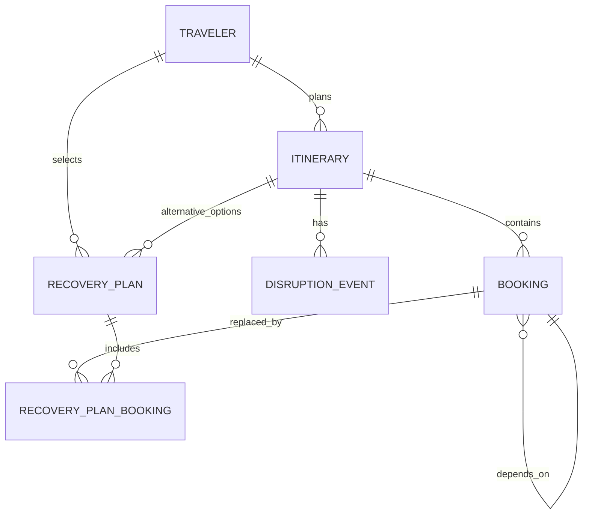
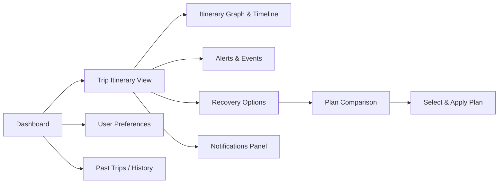
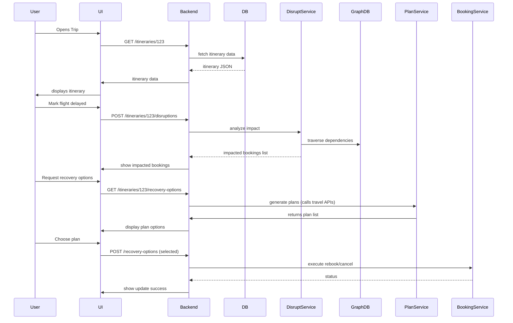

# Travel Disruption Recovery Engine — Design Report

**Intelligent Travel Resilience · Problem Statement ID 2**

> This is the full design and research report for the problem statement: product landscape, research findings, traveller pain points, proposed feature set, data model and APIs, architecture, differentiators, UX/sitemap, roadmap and a competitor comparison. It describes a full product vision. The shipped prototype in this repository implements a **local, single-process subset** of it — see [FEATURE_STATUS.md](FEATURES.md) for exactly what runs today and [RESEARCH.md](RESEARCH.md) for the verified primary sources. Everything that requires live supplier, payment, email or ML infrastructure is called out as proposed, not built.

**Executive Summary:** Modern travellers juggle complex, interconnected bookings (flights, trains, hotels, transfers, tours, etc.), and any delay or cancellation can cascade through their itinerary. Most existing tools (airline apps, booking sites, itinerary apps) offer some alerts or rebooking for individual bookings, but travellers must manually re-plan the rest of their trip. This report surveys existing products, research, and traveller feedback to propose a comprehensive *Travel Disruption Recovery Platform*. We enumerate key features (itinerary graph, impact analysis, multi-option recovery, proactive alerts), data models and APIs (including JSON schemas and Mermaid ER diagrams), system architecture, and a development roadmap. We highlight unique innovations (proactive risk scoring, policy-aware rerouting, automated rebooking, multi-modal options) and compare competitors/OSS solutions in a gap table. Our design integrates AI/optimization (graph algorithms, constraint-solving, ML/NLP) to turn disruption management from a manual ordeal into a seamless, personalized experience.

## 1. Real-World Products & Services

- **MakeMyTrip (MMT):** A major Indian OTA offering flights, hotels, trains, etc. Notably, MMT's "Trip Guarantee" (for rail tickets) promises refunds if a wait-listed ticket fails to confirm. However, traveller reviews on forums report *mixed experiences* — some praise the refund voucher, while others call it a "scam" due to complex refund conditions. Aside from this, MMT primarily handles bookings (with standard change/cancellation flows) but has no integrated itinerary rescue feature.
- **Booking.com (Consumer & Business):** Known for hotel bookings, Booking.com also offers flights and corporate travel tools. For business travellers, its platform lets users search/book across ~380 airlines (with flexible-fare options) and provides 24/7 support when changes occur. In case of disruption (e.g. flight cancel), a traveller can quickly rebook flights or find nearby hotels via the app. Booking.com's blog emphasizes that its "all-in-one" solution helps manage delays by combining flexible bookings with support. **Gap:** While useful, Booking.com is geared towards business use and does not expose itinerary relationships or multi-option planning to end consumers beyond its own bookings.
- **TripIt (SAP Concur):** A popular itinerary aggregator. Users forward confirmation emails (flights, hotels, car rentals) and TripIt automatically builds a consolidated itinerary. The free version handles itinerary collating; TripIt Pro adds *real-time flight alerts and reminders* (e.g. gate changes, delay notifications) and even provides travel guidance. For example, it can send alerts if you're eligible for a refund or if a connecting flight is at risk. **Gap:** TripIt organizes and alerts, but it does *not* proactively suggest recovery plans. It won't automatically rebook or compute alternative multi-leg solutions when a disruption occurs.
- **Google Travel (formerly Google Trips/Flights):** Google's ecosystem automatically aggregates bookings from Gmail and displays a trip timeline (destinations, transport, lodging). It offers flight/hotel search and sends flight status updates (via Google Flights). There's also "Google Trips" information cards (parking details, restaurants) in Google Assistant. **Gap:** Google's tools stop short of *recovery planning* — if a flight is canceled, Google may notify you but won't search alternate trips or replan your hotel check-in.
- **Hopper:** A mobile app for flights and hotels with price forecasts and flexible policies. Key feature: **"Flight Disruption Guarantee"** — if a booked flight is delayed or you miss a connection, Hopper can *instantly rebook* you without extra cost. It also offers "cancel/change for any reason" insurance add-ons. Hopper's 24/7 support helps travellers rebook on the spot. **Gap:** Hopper covers its own booked flights/hotels, but it does not model a full itinerary. Its service is mostly about refund/rebooking on Hopper-booked flights; it doesn't know about, say, your tour or train on the same trip.
- **Skyscanner/KAYAK/Expedia/etc.:** These are travel search engines/OTAs. They let you find and book flights, hotels, car rentals. **Gap:** They typically do *not* offer post-booking itinerary management; each booking is treated independently. Users often resort to manually rebooking via these sites if something is cancelled.
- **Airline Apps (e.g. Delta, American, Southwest):** Individual carriers' apps provide itinerary management for *that airline's* flights. They can alert passengers to delays, allow in-app rebooking or standby, and sometimes offer compensation support pages. For example, Delta has in-app messaging to rebook after a cancellation. **Gap:** These are siloed per airline and do not consider non-airline parts of a traveller's plan (hotel, car, cross-airline connections).
- **Global Distribution Systems (Amadeus, Travelport, Sabre):** These provide the underlying travel data and booking APIs used by airlines and agencies. Amadeus also has a "Travel Innovation Sandbox" with developer APIs for flight/hotel search, booking, and itinerary management. **Gap:** These are B2B platforms; while rich in data access, they do not directly implement a smart recovery engine for end-users. (For example, Amadeus offers airline disruption solutions internally but not a consumer-facing tool.)
- **Open-Source Projects (GitHub):**
  - **TREK (liketrek/TREK):** An open-source, self-hosted trip planner with collaborative planning, maps, budgets, and itinerary management. It handles multiple booking types (flights, trains, hotels, etc.) with status tracking, and imports confirmations via email or PDF. **Strengths:** Rich itinerary organization (day plans, maps, POIs) and trip document export. **Gap:** No intelligence for disruptions — it does not auto-detect changes or re-plan; it relies on users to update bookings manually.
  - **AdventureLog:** An open-source travel log and planner that combines trip itineraries with mapping. It supports flights, lodging, and transport per day and visualizes trips on a world map. **Strengths:** Self-hosted, interactive itinerary planning, collaborative trip building. **Gap:** Focuses on planning/logging; no automated disruption detection or recovery suggestions.
  - **(Others):** Various developer projects exist for routing (e.g. OpenTripPlanner for transit directions), but few target itinerary-level disruptions. We did not find open-source projects specifically for *automated disruption recovery*.

**Summary:** Existing consumer-facing tools excel at itinerary aggregation (TripIt, Google) or offer limited recovery (Hopper's delay guarantee for flights). However, none fully automates end-to-end disruption recovery across *all* trip components. There's a clear gap for a platform that understands the *entire itinerary graph*, detects impacts, and synthesizes alternative plans with multi-criteria optimization.

## 2. Research Literature & Industry Insights

- **Airline Disruption Management (Operations Research):** There is extensive OR research on airline irregular operations (IROPS). Recent reviews note that airline disruption models often treat *flights, crews, and passengers* as interdependent resources. For example, multicommodity network flow models optimize reassigning aircraft and passenger itineraries under delays. However, passenger itinerary recovery is typically **embedded** in these integrated models, not studied alone. McCarty & Cohn (in one study) even proactively reallocate passengers before missed connections occur. In practice, most literature addresses one airline's network; less work exists on consumer-level, multi-vendor itineraries. Nonetheless, the graph/network approach and ILP/column-generation techniques in airline research suggest that representing trips as graphs and using flow/optimization methods is promising.
- **Itinerary Graph Models:** The idea of an *itinerary graph* is emerging. (For instance, a 2026 technical post mentions "itinerary graph reconstruction" as a novel concept.) Academic work often models itineraries as nodes (bookings) linked by edges (dependencies like "flight arrival → hotel check-in"). Graph-based planning (e.g. route optimization, multi-modal trip planning) is well-studied in transportation research. We can leverage graph search (shortest-path, BFS) to identify chains of dependent bookings and to generate alternate routes through this graph. Graph databases (Neo4j, Amazon Neptune) or in-memory graphs could store itineraries and dependency relations for efficient querying.
- **Disruption Detection & Prediction:** Research in predictive travel analytics (e.g. flight delay forecasting) can feed our platform. Airlines and weather services collect historical delay data. Machine learning (gradient boosting, neural nets) is used to predict flight delays or cancellations based on weather, seasonality, and operations. Integrating such models (or APIs like FlightAware) could assign risk scores to each segment. In fact, platforms like Google Flights already incorporate some real-time status alerts. Academic work on delay prediction suggests using features like carrier, route, time-of-day, and weather. **Application:** We'll feed a risk estimator into the itinerary graph to highlight at-risk connections and trigger proactive warnings (as the hackathon brief suggests).
- **Recommendation & Optimization:** There is research on personalized itinerary recommendation (e.g. for tourism), often using travel data mining and multi-objective optimization. Techniques include heuristic search (e.g. genetic algorithms) to propose daily itineraries under time/budget constraints, or ML classifiers to rank points-of-interest. In our context, "recovery plan generation" is akin to solving a constrained optimization: pick alternative flights/trains/hotels such that costs, timings, and preferences are optimized. We may draw on travel recommendation literature and also on general optimization (knapsack, CSP). For example, a genetic algorithm has been used for itinerary optimization in the literature. At minimum, systematic search with pruning (e.g. branch-and-bound or greedy heuristics) will be needed to enumerate feasible recovery options.
- **Industry Articles:** Blogs and airline industry guides emphasize proactive disruption management. For example, Booking.com's business blog recommends using flexible fares and real-time trackers (e.g. FlightAware) to anticipate issues. It also notes digital tools (like booking systems with support) help mitigate delays. Insight: corporate travel users value 24/7 support and integrated tools — principles to borrow for our UX and support design.
- **Legal/Policy Context:** Passenger rights (EU EC261, Montreal Convention) determine refunds versus rerouting. For instance, EU rules mandate compensation for long delays/cancellations, and airlines must rebook or refund. We should incorporate these rules into our logic. As one travel guide notes, post-pandemic many airlines now allow free changes for basic fares — meaning cancellation penalties may be waived. Automating policy parsing (via NLP on airlines' rules) can help calculate refunds vs rebooking costs.

In summary, existing research underscores using *graph/flow models* and integrated optimization for itinerary recovery. We will adapt these ideas for a traveller-facing platform, combining graph analytics with AI (ML for delays, NLP for policies, heuristics for planning).

## 3. Traveller Pain Points & Desired Features (Forums/Reviews)

Travel forums and blogs echo the above challenges. The hackathon problem itself captures common complaints:

> *"Modern travel consists of interconnected bookings… Travellers currently have to **manually identify** affected bookings, check cancellation/refund policies, search for alternatives, calculate costs, and rearrange remaining plans."*

In user communities (e.g. Reddit, FlyerTalk), travellers frequently lament this manual hassle. Typical pain points include:

- **Missed connections:** If Flight A delays, it's stressful to figure out whether to rebook Flight B (next city leg) or to take a later train, and how this affects hotel check-ins and tours.
- **Multiple providers:** When part of a trip is on one airline/hotel site and others are elsewhere, no single portal shows all reservations.
- **Refund confusion:** Passengers struggle to understand which tickets are refundable, the fines, or compensation owed — often learning about EU or airline policies only after the fact.
- **Lack of alerts:** People express frustration at learning of a problem too late (often via an airline email or airport announcement) and not being guided to a fix.

One forum user, for example, warned others to *"read the terms… it was a huge trouble when the train ticket got confirmed but flight tickets [became unavailable]"*. Another buyer exclaimed that MakeMyTrip's Trip Guarantee is "completely fraud" because vouchers were limited to the same trip route. These comments reveal that travellers want **clarity and automation**: they want the system to *tell them* which bookings break, what their rights are, and to offer alternatives upfront.

Desired features gleaned from user feedback and travel blogs include:

- An integrated *single dashboard* showing the whole trip schedule (already offered by TripIt/Google).
- **Automatic alerts** when any leg is at risk (flight delay, weather warning).
- **One-click alternatives** for missed connections (find next flights/trains, alternate transfers).
- **Combined rebookings:** For example, if a flight is canceled, automatically refresh hotel booking to a new arrival time.
- **Cost transparency:** Clear display of added costs or refunds for each plan.
- **Proactive advice:** Warnings for tight connections or bad weather *before* departure.

These insights directly inform our feature design (next sections) — especially the need for proactive risk scoring and policy-guided suggestions.

## 4. Proposed Feature Set

Below are the core features of the proposed platform. For each we outline the *purpose*, *user flow*, *data I/O*, key *algorithms*, edge cases, UI considerations, and success metrics.

- **Itinerary Ingestion & Graph Representation:**
  - *Purpose:* Build a complete travel itinerary graph from a user's bookings (flights, trains, hotels, transfers, events). Identify dependencies (edges) where one booking's timing affects another.
  - *User Flow:* The traveller imports their trip by connecting email (or forwarding confirmations) or via integrations (TripIt API, etc.), or by manual entry. The system parses each booking (supplier, times, locations) and adds nodes to the itinerary graph.
  - *Data:* Inputs are booking records (confirmation emails/PNR data) containing dates, times, locations, suppliers, confirmation codes, fare rules. Output is a graph (or JSON structure) linking bookings by time and dependency (e.g. Flight A "connects to" Shuttle B).
  - *Algorithms:* Use **parsing** (Regex/ML) to extract details from structured texts. Represent each booking as a node with attributes (e.g. flight duration, cost, refundability). Create edges by logical rules (e.g. if flight arrival time > transfer departure time, add dependency). Graph database (e.g. Neo4j) or in-memory graph can store relationships for queries.
  - *Edge Cases:* Overlapping bookings (e.g. flights and trains on same day), time zone changes, "floating" activities (tours with flexible times). The system should handle multi-segment flights (legs), overnight hotels spanning days, and multi-modal transfers.
  - *UI:* Show a **timeline or dependency graph** of the trip. For example, a visual itinerary (like Gantt or flowchart) marking each leg and connection. Bookings can be collapsible by day or segment.
  - *Metrics:* *Coverage:* percent of bookings correctly parsed/linked. *User correction rate:* how often users edit auto-parsed bookings. (Aim >95% accuracy.)

- **Disruption Detection:**
  - *Purpose:* Identify when a booking (or external factor) is disrupted. Disruptions include delayed/canceled flights, train delays, hotel cancellations, severe weather, or user-initiated changes.
  - *User Flow:* A disruption can be *pushed* (user receives an email/call and tells the app) or *pulled* (system polls APIs or monitors feeds). When a disruption is detected, the user is alerted in the app (push notification or alert banner).
  - *Data:* Inputs: real-time data feeds (airline status APIs, train status, weather alerts) or user input (e.g. "Flight AA123 delayed 4h"). Output: a "disruption event" object that marks which itinerary node(s) are affected, and the disruption type (delay, cancel).
  - *Algorithms:* Integrate with airline/travel APIs (e.g. FlightAware, OAG, national rail status). For each upcoming segment, check status periodically. Use ML or rules to decide if a delay crosses a threshold (e.g. >30 min). For weather, use severity models (e.g. NOAA data).
  - *Edge Cases:* Graceful handling of false alarms (e.g. very short delays that don't impact connections). If a flight is diverted (arrives at a nearby airport), flag that differently. Recognize when a booking is on-hold (overbooked) vs confirmed.
  - *UI:* Show a **notification panel** with disrupted legs highlighted (e.g. a red icon next to the affected flight on the timeline). Provide details ("Flight delayed by 3h due to weather").
  - *Metrics:* *Detection latency:* time from real-world delay to user alert. *False positive rate:* ensure minimal incorrect alerts.

- **Impact Analysis (Dependency Traversal):**
  - *Purpose:* Compute which other bookings are impacted by this disruption. E.g. a missed connection or conflict with a hotel check-in.
  - *User Flow:* Upon disruption alert, the platform automatically flags all downstream bookings that may conflict. The user sees a list of "At-risk bookings" with explanation ("This canceled flight may cause you to miss your 3 PM train").
  - *Data:* Input: itinerary graph and the disruption event. Output: a subgraph or list of affected nodes (bookings) and the type of impact (missed connection, delayed arrival).
  - *Algorithms:* Perform graph search/propagation from the disrupted node. For each outgoing edge (dependent booking), check if timing constraints fail (arrival time > next booking's required start). Recursively mark each downstream booking (including hotels with check-in windows, tours, etc.).
  - *Edge Cases:* If the trip has slack (long layovers), downstream items may not be affected. If bookings are independent (e.g. separately booked flights in a single city), some conflicts are false. The system should suggest splitting the travel into independent segments if possible.
  - *UI:* On the itinerary graph/timeline, *highlight* impacted bookings (e.g. orange flags). Provide a summary: "2 downstream items affected". Possibly a "connection risk score" for at-risk transitions.
  - *Metrics:* *Impact accuracy:* percent of actual conflicts correctly identified. *User trust:* whether users agree with flagged impacts.

- **Recovery Option Generation:**
  - *Purpose:* Generate multiple alternative recovery plans that resolve the disruption while respecting constraints. Each plan is a new itinerary (or modifications) that restores the trip as much as possible.
  - *User Flow:* The user clicks "Find alternatives" after a disruption. The system returns 2–5 feasible recovery plans (e.g. alternative flights/trains, hotel rebookings). Each plan shows changes in cost, schedule, and itinerary. The user can compare and select one.
  - *Data:* Inputs: itinerary graph, set of affected bookings, user preferences (budget limit, airline loyalty, etc.), API access to travel availability. Outputs: a list of "recovery plan" objects, each containing a set of new or modified bookings with computed cost and time metrics.
  - *Algorithms:* This is the core optimization challenge. The system must re-search travel options for each affected segment, potentially in combination. Strategies include:
    - **Constraint Solving:** Formulate as a CSP/ILP: variables = new choices for each broken leg (flight/train options, hotel nights); constraints = schedule consistency (transfers), policy restrictions; objective = minimize total cost + inconvenience. Use solvers (e.g. OR-Tools) for small cases.
    - **Graph Search/Heuristics:** Perform a multi-criteria search: for each affected segment, find top-N alternative connections (using flight APIs, train schedules). Then use a recursive search or heuristic (greedy, beam search) to combine these alternatives into coherent plans.
    - **Machine Learning:** Optionally, learn from past user choices to rank likely-preferred alternatives (e.g. prefer same airline/shorter layovers).
    - **Cancellation Policy Logic:** Incorporate costs of canceling original bookings. For example, parse airline/hotel rules (via NLP on terms and EC261 guidelines) to compute refund vs rebooking penalties.

    Each plan should list: new arrival time, changed bookings, incremental cost, and forfeited bookings.
  - *Edge Cases:* Overlapping solutions (two alternatives identical except one cheap flight vs another). Plans that cancel the trip entirely if recovery isn't possible. Cases where no seat is available; then suggest "last resort" (e.g. break journey in between).
  - *UI:* Present a **comparison table** of plans: columns like *Option A, B, C*, rows for *new flight, new train, total delay, extra cost, refunds.* Use icons to highlight best in each metric. Include maps if helpful (e.g. routes).
  - *Metrics:* *Plan coverage:* how many viable plans generated. *Quality:* ranking should match the user's pick (maybe 80% top-choice). *Plan generation time:* must be fast (seconds to a couple of minutes).

- **Plan Comparison & Selection:**
  - *Purpose:* Allow the traveller to easily compare suggested recovery plans on key metrics (cost, total delay, inconvenience).
  - *User Flow:* After generation, the UI shows options side-by-side. The user can select one plan (or request modifications like "avoid evening flights"). The platform then applies the changes.
  - *Data:* Input: list of plans with attributes (cost, time, number of changes). Output: the chosen plan and its revised itinerary.
  - *Algorithms:* Compute summary metrics for display: total layover change, out-of-pocket cost (additional fare − refunds), convenience score. Possibly run an aggregate scoring model (weighted sum of user preferences).
  - *Edge Cases:* If no plan fully restores the trip (e.g. hotel must be canceled), communicate partial plans (maybe 2 options: "rebook to nearest city and take bus vs cancel day").
  - *UI:* A detailed comparison screen. Provide filters (e.g. sort by cost). Mark the "best" option in green (e.g. minimal cost) and highlight trade-offs (like 2h more travel). A summary prompt: "You selected Plan B: you save $100 but will arrive 3h later than originally" etc.
  - *Metrics:* *Selection rate:* how often a non-default plan is chosen (indicates user engagement). *User satisfaction:* post-recovery survey (did the chosen plan meet needs?).

- **Itinerary Update & Synchronization:**
  - *Purpose:* Once a plan is selected, automatically update the itinerary: cancel old bookings (if needed), confirm new ones, and reflect changes everywhere.
  - *User Flow:* After confirming a recovery plan, the system performs or guides bookings: e.g. rebook flight, cancel hotel/resend vouchers. The updated itinerary is saved. The user's calendar/email can be synced.
  - *Data:* Inputs: chosen recovery plan. Outputs: updated itinerary graph; confirmations or tickets for new bookings.
  - *Algorithms:* Integrate with booking APIs (Amadeus/Sabre, or GDS) or web-services to place new reservations and process cancellations. Handle transactional rollback if a booking fails (e.g. credit card declines, no seats left). Use idempotency and logging.
  - *Edge Cases:* Partial failure (one new leg fails). Must handle retries or offer fallback (e.g. try next best plan). If new booking costs more than expected, ask user approval.
  - *UI:* Show progress ("Booking new flight…", "Cancelling hotel…"). If user intervention needed (e.g. payment), display prompts. Finally, show confirmation of updated itinerary.
  - *Metrics:* *Execution success rate:* percent of bookings successfully updated without errors. *Time to complete rebooking.*

- **Proactive Risk Warnings:**
  - *Purpose:* Anticipate and warn about potential disruptions *before* they happen. For example, flag a tight connection when booking, or alert if inbound flight has a history of delays.
  - *User Flow:* While viewing a trip, the system highlights risks (e.g. a red exclamation on a short connection). It might also periodically check upcoming legs and send warnings if new information emerges (e.g. "Your train today may be canceled due to strike").
  - *Data:* Inputs: itinerary and third-party data. Outputs: risk alerts and recommendations (e.g. "We suggest adding a 3rd hour buffer at JFK airport").
  - *Algorithms:* Combine flight delay prediction models, weather forecasts, known traffic strikes, and user profile (some users prefer extra time) to compute a "risk score" for each connection or segment. For example, logistic regression or decision tree on historical data (we might partner with a data provider, or train on open delay datasets).
  - *Edge Cases:* Over-warning fatigue: ensure only significant risks (e.g. >70% chance of >2h delay) produce alerts. Distinguish natural events (snow) vs random.
  - *UI:* Warning banners (e.g. yellow triangle) on itinerary view. Possibly calendar invites to leave earlier. Provide options ("rebook to flight X as backup").
  - *Metrics:* *Prediction accuracy:* measured by whether flagged connections do become disrupted (precision/recall). *User trust:* do users heed recommendations?

- **User Preferences & Profiles:**
  - *Purpose:* Customize recovery according to traveller's needs (e.g. budget vs time tradeoff, loyalty airlines, seat/class, travel companions).
  - *User Flow:* User sets preferences once (e.g. "I only fly Economy, prefer morning flights, avoid drive >2h"). These guide option ranking.
  - *Data:* Preferences (stored in user profile), possibly learned from past choices.
  - *Algorithms:* Use preferences as soft constraints or weights in scoring recovery plans. For example, add penalties for layovers at odd hours, or prefer flights by preferred airline.
  - *Edge Cases:* Conflicting preferences (low cost vs no overnight). The UI should show why a plan was chosen based on preferences.
  - *UI:* A preferences/settings page where user can indicate priorities (using sliders: cost vs time, add loyalty program info, select seat requirements etc).
  - *Metrics:* *Personalization lift:* compare plan success with/without preferences; user satisfaction by profile match.

- **Policy & Refund Parsing (NLP):**
  - *Purpose:* Automatically interpret fare rules and refund/cancellation policies to compute realistic costs of each plan.
  - *User Flow:* When generating options, the system displays how much will be refunded or charged. (E.g., "Canceling your $200 flight yields $180 voucher (no cash refund)").
  - *Data:* Inputs: airline/hotel fare rules text or regulation (EC261). Output: numeric refund/cancellation cost.
  - *Algorithms:* Use NLP (or simple rule-engine) to parse unstructured terms from e-tickets or policy websites. For example, detect if ticket is refundable, any change fee, or if protected by law. A small knowledge base of regulatory rules can augment this.
  - *Edge Cases:* Some policies are convoluted ("non-transferable voucher only") — in doubt, flag as "check with provider" or be conservative.
  - *UI:* Show an itemized cost breakdown per option: "Refund from original tickets: $X; Change fees: $Y".
  - *Metrics:* *Policy accuracy:* correctness of parsed refund values (could be spot-checked by human testers on sample tickets).

The above features cover the end-to-end flow from **itinerary import** to **recovery execution**. Each feature relies on the data model and system components described next.

## 5. Data Model & API Design

We propose an **Entity-Relationship** model like the following Mermaid diagram:



- **Entities:**
  - *Traveller:* user profile (preferences, ID).
  - *Itinerary:* a trip (id, name, start/end dates) belonging to a traveller.
  - *Booking:* each reservation (flight leg, hotel stay, train, car, tour). Attributes include type, vendor, start_datetime, end_datetime, cost, currency, status, refund_policy, reservation_code, etc.
  - *DisruptionEvent:* an event (id, type, timestamp, notes) referencing affected bookings.
  - *RecoveryPlan:* a proposed alternative plan (id, created_at, summary) with references to new bookings (through a join *RecoveryPlan_Booking* table linking plans to bookings).

- **Relationships:**
  - A *Traveller* has many *Itineraries*.
  - Each *Itinerary* contains multiple *Bookings*.
  - Bookings may **depend_on** other bookings (recursive FK): e.g. a hotel booking depends on an arriving flight.
  - A *DisruptionEvent* is linked to one or more Bookings (the disrupted ones).
  - A *RecoveryPlan* is linked to an *Itinerary* and to one or more new *Bookings* that it entails.
  - The traveller can select one *RecoveryPlan* per disruption.

**JSON Schema Samples:** (illustrative)

*Itinerary with bookings:*

```json
{
  "itineraryId": "trip_12345",
  "travelerId": "user_678",
  "bookings": [
    {
      "bookingId": "b1",
      "type": "flight",
      "vendor": "Delta",
      "confirmNumber": "DL123",
      "start": "2026-10-10T08:00:00-04:00",
      "end": "2026-10-10T10:30:00-07:00",
      "from": "JFK",
      "to": "SEA",
      "cost": 350.0,
      "currency": "USD",
      "status": "confirmed",
      "refundable": false
    },
    {
      "bookingId": "b2",
      "type": "transfer",
      "vendor": "Uber",
      "start": "2026-10-10T11:00:00-07:00",
      "from": "SEA",
      "to": "HotelXYZ",
      "status": "booked"
    },
    {
      "bookingId": "b3",
      "type": "hotel",
      "vendor": "Booking.com",
      "confirmNumber": "HTL789",
      "start": "2026-10-10T12:00:00-07:00",
      "end": "2026-10-12T11:00:00-07:00",
      "location": "Seattle",
      "status": "confirmed",
      "cancellation_policy": "Free cancel until 24h before"
    }
  ]
}
```

*Disruption event:*

```json
{
  "eventId": "evt_001",
  "itineraryId": "trip_12345",
  "affectedBookings": ["b1"],
  "type": "flight_delay",
  "description": "Flight DL123 delayed 4h due to weather"
}
```

*Recovery plan:*

```json
{
  "planId": "plan_9",
  "itineraryId": "trip_12345",
  "changes": [
    {
      "oldBookingId": "b1",
      "newBooking": {
        "bookingId": "b1_alt",
        "type": "flight",
        "vendor": "United",
        "confirmNumber": "UA456",
        "start": "2026-10-10T12:00:00-07:00",
        "end": "2026-10-10T14:30:00-10:00",
        "cost": 400.0,
        "status": "proposed"
      }
    },
    {
      "oldBookingId": "b2",
      "newBooking": {
        "bookingId": "b2_alt",
        "type": "transfer",
        "vendor": "Lyft",
        "start": "2026-10-10T15:00:00-10:00",
        "from": "PIT",
        "to": "HotelXYZ",
        "status": "proposed"
      }
    }
  ],
  "totalAdditionalCost": 60.0,
  "totalDelay": 4.5,
  "score": 0.87
}
```

**Key API Endpoints:** (REST-style)

- `GET /api/itineraries/{tripId}` – Retrieve full itinerary.
- `POST /api/itineraries` – Create/import a new itinerary (upload email or JSON).
- `GET /api/itineraries/{tripId}/disruptions` – List disruptions for the trip.
- `POST /api/itineraries/{tripId}/disruptions` – Report a new disruption event (or triggered by system).
- `GET /api/itineraries/{tripId}/impact` – Compute affected bookings after a given disruption.
- `GET /api/itineraries/{tripId}/recovery-options` – Generate recovery plan options.
- `POST /api/itineraries/{tripId}/recovery-options` – Submit chosen plan (apply changes).
- `GET /api/itineraries/{tripId}/preferences` – Get user preferences (for plan ranking).

Each API uses JSON schemas akin to above. Responses include linked booking details and metrics for easy consumption by the front-end.

## 6. System Architecture

A scalable web architecture is envisioned, with the following components:

- **Frontend (Web/Mobile):** A single-page app (React or Angular) or native mobile front end, presenting the itinerary timeline, alerts, plan comparisons. It consumes the REST APIs. Use interactive graphs (D3.js or Plotly) for timeline/graph visualization and plan comparison tables.

- **Backend Services:** Likely a microservices architecture (or modular monolith) with services for: Itinerary management, Disruption detection, Impact analysis, Plan generation, Notifications, and User profiles. Each service could be built in Node.js, Python (Flask/FastAPI), or Java/Kotlin.

- **Databases:**
  - *Relational DB (Postgres/MySQL):* Store user accounts, itineraries metadata, booking records (for ACID transactions on updates), recovery plan records.
  - *Graph DB (Neo4j or ArangoDB):* Store the itinerary graph for fast dependency queries and traversal. Each itinerary can be a subgraph; disruptions trigger graph queries to find downstream impacts.
  - *Cache/Index:* In-memory cache (Redis) for quick lookup of active itineraries and pre-computed risk scores. Use Elasticsearch if needed for full-text search (e.g. on bookings, policies).

- **Real-Time/Streaming:** Use a message queue (Kafka/RabbitMQ) for asynchronous tasks. For example, a "Disruption Stream" collects real-time events (flight status updates, weather alerts) which trigger jobs in the Disruption Detection service.

- **External Integrations:**
  - *Travel APIs:* Integrate with flight/hotel search and booking APIs (Amadeus for Developers, Sabre APIs, Skyscanner, Google Flight Search API) to find alternatives.
  - *Flight/Train Status Feeds:* For example, FlightAware, FlightStats, or national railway APIs.
  - *Weather APIs:* NOAA or commercial weather APIs for forecasts at departure/arrival airports.
  - *Calendar/Email:* Optionally integrate with Google/Outlook Calendar to sync itinerary.

- **Machine Learning Infrastructure:** For risk prediction and recommendations. Use Python ML stack (scikit-learn, TensorFlow). Deploy models as REST microservices or via AWS SageMaker endpoints. Store historical travel/delay data for training.

- **Security & Privacy:**
  - Use OAuth2/OpenID Connect for user authentication (allow login via Google/Apple etc).
  - Encrypt all PII in transit (HTTPS) and at rest (DB encryption).
  - Respect GDPR: e.g. allow users to delete data.
  - PCI compliance if storing payment info (for rebooking), likely integrate with third-party payment providers.
  - Data isolation: Customers' data segregated (multi-tenant).

- **Scalability:**
  - Deploy on cloud (AWS/Azure/GCP) with auto-scaling groups.
  - Load balancers for web/API servers.
  - Microservices containerized (Docker/Kubernetes).
  - Use a graph-optimized cloud DB or managed service (e.g. Amazon Neptune, Neo4j Aura) to handle large itineraries.
  - Ensure high availability for disruption alerts (which are time-sensitive).

- **Privacy Considerations:** Itineraries contain sensitive location and personal data. We should not share or sell data. Implement anonymization for any analytics. Clearly state data use in privacy policy. Comply with airline data-sharing terms.

**Integration with Third Parties:** This platform will call out to various travel providers. Use vendor APIs where possible; if not, leverage GDS APIs or aggregator (some have public APIs). Partnerships with GDS/OTAs could facilitate rebooking rights.

In summary, the architecture uses standard web-tech with added components for real-time event processing (for disruption alerts) and a specialized graph database for itinerary modeling. This allows quick impact queries and scalable handling of large travel datasets.

## 7. Innovative Features & Differentiators

Based on research and community input, our platform will include several novel capabilities:

- **Proactive Risk Scoring:** Using ML and external data, compute a risk score for each connection (flight-train, flight-flight, etc.). For example, we might train a model that flags "80% chance of missing connection" given current flight status and layover time. This score triggers alerts and can even suggest alternative (early) flights proactively. (Feasibility: moderate – requires delay datasets. Impact: high, as it moves from reactive to proactive recovery.)
- **Automated Rebooking Actions:** With user consent, the platform can automatically rebook alternative options when selected. For instance, "Auto-Rebook" mode could charge the user's payment method directly to confirm new bookings and cancel old ones without manual steps. Similar to Hopper's model, but covering multi-leg trips. (Feasibility: complex – needs deep API integration and transaction safety. Impact: high convenience.)
- **Multi-modal Recovery Options:** If traditional options fail, propose alternate modes. E.g. If a flight is canceled and no seats, suggest a train or bus route, or a car rental (this leverages multimodal routing algorithms, e.g. via OpenStreetMap/GTFS data). (Innovation: high. Implementation: integrate transit and mapping APIs like Rome2Rio or Transport API.)
- **Cost-Aware Optimization:** In plan generation, explicitly optimize for different criteria. Options could include "Minimize total cost (including penalties)" vs "Minimize travel time" vs "Minimize itinerary changes". The UI could let users select their priority. (Using multi-objective optimization or Pareto analysis, with perhaps user-set weights.)
- **Collaborative/Group Itineraries:** Though another hackathon problem covers this, we could allow linking multiple travellers' itineraries for common trips. This way, if one person's flight delays, the system could alert the group and suggest group plans. (Complexity: beyond core MVP, but noted for future.)
- **Legal/Policy Aware Suggestions:** Embed knowledge of passenger rights (EC261, Montreal convention) and travel insurance terms. For example, if we detect an EU-disrupting delay, automatically note that the user is *due compensation* and even auto-fill claim requests. (Feasibility: moderate – rules are public but integrating all airline policies is tough; even partial integration adds value.)
- **Chatbot/Conversational UI:** Optionally, use an AI assistant (e.g. chatbot) to help travellers understand options ("Why do I see a $50 extra charge?") or even to interact ("Find me a train if I miss my flight"). (Emerging tech – could use GPT-style models for explanation, though careful to fact-check.)
- **Sustainability & Accessibility Considerations:** As stretch goals, incorporate features like suggesting lower-emission connections (green routing) or ensuring alternate plans meet user's special needs (wheelchair accessible transfers). These align with trends but add complexity.

Each of these features is **unique** compared to current tools and directly addresses identified gaps. Implementation notes:

- Risk scoring needs data pipelines (historical delays).
- Auto-rebook requires robust API support and failure handling (e.g. backout flows).
- Multi-modal routing can reuse existing open frameworks.
- Policy parsing may leverage LLMs or rules engines trained on airline T&Cs.
- Chatbot could start as a scripted FAQ before ML-based.

## 8. Prototype UX / Sitemap / Wireframes

**Sitemap & User Flows:** Key screens include:



- **Dashboard:** Lists current trips (with summary of upcoming travel) and any pending alerts.
- **Trip Itinerary View:** Shows the itinerary timeline or graph (flights, hotel, etc.). Dependencies are visualized.
- **Disruption/Alerts Panel:** Highlights any disruptions or warnings (red/yellow icons on affected legs).
- **Recovery Options Screen:** After a disruption, lists alternative plans in a table or card layout. Each option shows changed legs and key stats (cost, delay).
- **Plan Comparison:** A side-by-side view (or single table) of selected plans with metrics row by row.
- **Preferences Page:** User can set travel priorities (cost vs time, airlines, special needs).

*Sample Wireframe (textual)*:

- **Itinerary Graph Screen:** On the left, a collapsible tree of trip legs by day; on the right, a timeline chart. Disrupted legs are highlighted in red.
- **Recovery Options Screen:** A table with columns Option A / B / C; rows like *New Flight*, *New Hotel*, *Extra Cost*, *Arrival Change*. Icons indicate best values.
- **Compare & Confirm:** A summary view of the chosen plan, with "Confirm Rebook" button.

*(Images not shown here.)*

**Component Interaction Flow:** For example, a **sequence diagram** of user flow:



## 9. Implementation Roadmap

We suggest a phased, agile development plan. A Mermaid Gantt chart outlines key milestones:

```mermaid
gantt
    dateFormat  YYYY-MM-DD
    axisFormat  %b %Y
    title Travel Recovery Platform Roadmap

    section Phase 1 (MVP)
      Itinerary Ingestion & Graph        :done,    inception, 2026-10-01, 2w
      Disruption Detection Module        :active,  disrupt_det, after inception, 1m
      Impact Analysis Logic             :         impact_calc, after disrupt_det, 1m
      Basic Recovery Search Engine      :         search_engine, after impact_calc, 2m
      Minimal UI for Alerts/Options     :         ui_dev, after search_engine, 2m

    section Phase 2
      Multi-Option Planning & UI        :         opt_ui, 2027-02-01, 2m
      Cancellation Policy Parser        :         policy_nlp, after opt_ui, 1m
      Apply Plan & Itinerary Update     :         apply_flow, after policy_nlp, 1.5m

    section Phase 3
      Risk Scoring / Prediction        :         risk_model, after apply_flow, 2m
      User Preferences & Profile        :         user_prefs, parallel, 1m
      Refine AI Suggestions            :         ai_rank, after risk_model, 2m

    section Phase 4
      Third-Party Integrations         :         api_integr, after ai_rank, 2m
      Security & Compliance Testing    :         security, after api_integr, 1m
      Beta Testing & Launch Prep       :critical, testing, after security, 1m
```

- **MVP (0–4 months):** Fundamental features: itinerary import, disruption detection, basic recovery search (e.g. via single-source API calls), and a simple UI showing alerts and one alternative. *Effort:* Medium. *Success:* Verify that the system correctly ingests trips and can generate at least one valid recovery plan end-to-end.
- **Phase 2 (5–8 months):** Expand to multiple plan generation, user interface for comparing options, advanced cost/refund calculations (NLP), and full "apply plan" workflow. *Effort:* High (complex UI + integration). *Success:* Able to handle real multi-leg trips; users can select and execute alternate plans reliably.
- **Phase 3 (9–12 months):** Implement risk prediction, ML enhancements, and personalization. Integrate user profiles and preference-driven planning. *Effort:* High (data science, UX polishing). *Success:* Alerts show meaningful forecasts; user feedback improves plan relevance.
- **Phase 4 (13–15 months):** Scalability and polishing: connect with more external APIs (for flights, trains globally), rigorous security/privacy audit, and prepare for beta launch. *Effort:* Medium. *Success:* System can handle thousands of concurrent users; passes security review; readiness for real-user trial.

**Milestones & Criteria:**

- *Milestone 1:* End of Phase 1 – Basic itinerary graph and one-plan recovery works. Demo to stakeholders.
- *Milestone 2:* End of Phase 2 – Multi-option recovery UI live. Beta test with users.
- *Milestone 3:* End of Phase 3 – Risk predictions integrated, personalization live. Assess with pilot metrics (e.g. time saved).
- *Milestone 4:* Launch – System passes all QA and usability goals, ready for public release.

Effort estimates:

- *Low:* small feature/UI changes (2–3 dev-weeks).
- *Medium:* Core engineering (1–2 months).
- *High:* Complex integrations or ML models (3+ months).

Success will be measured by system reliability (uptime), performance (response times <3s), and user satisfaction (surveys, adoption in pilot groups).

## 10. Competitors / OSS Comparison

| **Product/Project**           | **Key Features**                                                                                                          | **Gap vs. Our Platform**                                                                                                                            |
| ----------------------------- | ------------------------------------------------------------------------------------------------------------------------- | --------------------------------------------------------------------------------------------------------------------------------------------------- |
| **TripIt** (mobile/web app)   | Auto-itinerary builder via email; real-time flight alerts. Consolidated view of bookings.                                 | Alerts but no automated recovery; does not suggest alternative plans or update rest of itinerary after a disruption.                                |
| **Hopper** (mobile app)       | Flight/hotel search with price prediction; "Flight Disruption Guarantee" auto-rebooks delayed/missed flights. Simple "change for any reason" plans. | Limited to Hopper-booked flights/hotels; no multi-stop trip logic (e.g. won't rebook connecting train or adjust hotel). No user-facing itinerary graph. |
| **Booking.com (Business)**    | Global travel search (flights, hotels); flexible fares; 24/7 support for rebooking. Corporate travel dashboard.          | Focuses on corporate scenario; no automated link between flights/hotels/trains. No consumer-grade interface for personal itineraries.              |
| **Airline Apps (e.g. Delta)** | Manage own flights (check-in, changes), push notifications. Some auto-rebooking for delays.                               | Only covers single airline's flights; no integration with other carriers or ground/hotel services.                                                  |
| **Skyscanner/KAYAK**          | Flight/hotel/car search engine; price alerts and basic itinerary view.                                                    | No disruption management beyond notifying price changes; each booking independent.                                                                  |
| **AdventureLog (OSS)**        | Self-hosted travel planner: multi-day itineraries, flights, lodging, maps.                                                | Great for logging trips and planning ahead, but no real-time alerts or recovery planning.                                                           |
| **TREK (OSS)**                | Collaborative trip planner: maps, budgets, multiple booking types.                                                        | Robust itinerary management and checklists, but no AI to handle disruptions or generate alternatives.                                              |
| **Amadeus/Travelport (GDS)**  | Enterprise travel platform, rich API for flights/hotels. Some corporate disruption modules exist.                         | Not a consumer-facing product; no end-user app. They provide data but leave recovery logic to agencies.                                             |

**Gap Analysis:** No existing solution combines *itinerary-wide awareness*, *automated impact analysis*, and *multi-option recovery* in a single package. Our platform uniquely offers:

- **Full itinerary graph:** Connects all bookings in one view (beyond just flights).
- **Automated recovery suggestions:** Multiple plan generation vs. manual search.
- **Cross-service integration:** Handles flights, trains, hotels, etc. simultaneously.
- **Proactive intelligence:** Risk scoring and policy compliance built-in.

These differentiators address clear shortcomings in competitors and fill the market gap for intelligent travel resilience.

**Sources:** We drew on official product descriptions and user forums to inform this comparison.
